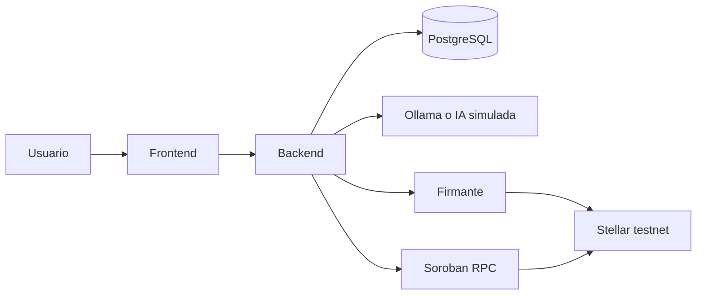

# Nexora

[](https://github.com/JLeonG09/Nexora/actions/workflows/ci.yml)

Panel para pagar en USDC sobre Stellar con un agente de IA que **solo propone**. El backend comprueba cada pedido contra los contactos y el mandato del usuario, y un firmante aparte envía la transacción. Si sale un pago que el agente no hizo, el sistema lo detecta y avisa.

Envío del **General Track** de Stellar Passport «Find Your Way». Equipo **Nexora**: Josué León, Santiago Fuentes Loaiza y Derling Torres Campos. Entrega: lunes 5 de octubre de 2026, 4:00 p. m. (hora de Costa Rica).

Solo testnet. Sin auditoría de seguridad. No usar con fondos reales.

## El problema

Dejar que un agente guarde las llaves de pago es arriesgado: puede gastar de más, y un uso de esa llave desde fuera del agente puede pasar desapercibido hasta que el dinero ya salió.

## La solución

La IA elige contacto, monto y memo. El backend decide si ese pedido se firma. Aplica, en orden, estas reglas, y deja en la auditoría cuáles pasaron:

1. **Esquema.** Solo los campos permitidos, como texto, y el activo USDC.
2. **Confianza.** Por encima de `AI_MIN_CONFIDENCE` (0,7) y sin campos que la IA no pueda fundamentar.
3. **Lista blanca.** El destinatario es un contacto del usuario. La dirección sale de la base.
4. **Monto en el mensaje.** El monto aparece escrito tal cual en lo que escribió la persona.
5. **Mandato vigente.** Hay un mandato activo y todavía no venció.
6. **Tope por pago.**
7. **Tope diario.** Ventana móvil de 24 horas, con la cuenta bloqueada para evitar carreras.
8. **Frecuencia.** Como máximo 5 propuestas cada 10 minutos.

Si el monto supera el umbral de aprobación del mandato, el pago queda en espera hasta 24 horas y una persona lo aprueba o lo rechaza. Al aprobar se vuelven a comprobar el mandato, el tope por pago y el tope diario. Por debajo del umbral se pide la firma enseguida.

Cada paso (chat, validación, aprobación, firma, confirmación, alerta) queda en `GET /api/audit`.

La smart account puede frenar además el pago en la red con su política de tope de gasto (`SpendingLimitExceeded`). El firmante simulado, que es el modo por defecto, aplica **50 USDC en 24 horas** por cuenta. El firmante real, aparte, no firma lo que pase de su tope propio: **100 USDC por transacción** y **500 USDC cada 24 horas** (`MAX_AMOUNT_PER_TX`, `MAX_AMOUNT_PER_PERIOD`).

Si sale USDC de la cuenta en una transacción que no corresponde a una propuesta del chat, el backend crea una alerta. Confirmarla marca el movimiento como propio. Reportarla revoca el mandato, rota la llave del agente y registra `LLAVE_COMPROMETIDA`. La regla on-chain sigue activa hasta que la persona la borre con su passkey: el aviso de la alerta lo dice.

## Cómo funciona

| Parte | Rol |
| --- | --- |
| Frontend | Panel en React (Vite), en modo Sencillo (por defecto) o Avanzado. Chat, contactos, mandato, aprobaciones, alertas e historial; auditoría y la demo de llave robada solo en Avanzado. Registra y muestra; la firma vive en otro servicio. |
| Backend | API Spring Boot (Java 21). Valida, audita, pide la firma y concilia eventos. |
| Firmante | Servicio Node 22. Deriva una llave Ed25519 por smart account y versión, firma y envía. |
| Base de datos | PostgreSQL 16. Flyway crea el esquema al arrancar el backend. |
| IA | En Docker, modo híbrido: reglas fijas y Ollama (`qwen2.5:0.5b`, unos 400 MB) solo para clasificar la intención. Con `AI_MODE=local` un modelo más grande usa la API de chat de OpenAI y la herramienta `propose_payment`. También hay reglas solas (`mock`) y un cliente HTTP. En ARM se puede usar [`cactus serve`](https://github.com/cactus-compute/cactus); Cactus no compila en x86. |



### Flujo de una persona

1. Entra con Privy (correo con código o Google). El backend acepta el access token ES256 (`iss` de privy.io, `aud` = `PRIVY_APP_ID`) y `POST /api/users` vincula al usuario con el `sub`. Sin App ID el panel solo usa datos de prueba. Después registra la dirección `C…` de una smart account de testnet que ya existe. El panel no la despliega.
2. Agrega contactos y crea el mandato: tope diario (el formulario parte de 50 USDC, el mismo tope on-chain del firmante simulado), tope por pago y umbral a partir del cual hay que preguntar, junto con la llave pública que devuelve el firmante. La regla de contexto se instala fuera del panel; aquí se registran su id, el ledger de vigencia y el hash de esa transacción. Con el firmante real el backend consulta ese hash y responde 422 si la transacción no está en SUCCESS o no llama a la smart account.
3. En el chat escribe a quién pagar y cuánto. La IA propone. El activo lo fija el backend: USDC.
4. El backend corre las ocho reglas. Bajo el umbral pide la firma. Por encima, espera la aprobación en `/aprobaciones`.
5. El firmante comprueba que la llave del mandato sea la que él deriva y, en la red, que la regla exista, incluya esa llave y tenga un spending-limit vigente cuyo tope no supere el del mandato. También aplica su tope propio (100 USDC por pago, 500 USDC en 24 horas). Si pasa, firma el `transfer` y lo envía por esa regla de contexto. El mismo `proposalId` no se paga dos veces.
6. Cada minuto el backend lee los `transfer` de USDC que salieron de la cuenta desde que se registró. Los que no hizo el chat aparecen en `/alertas`.

Estados de una propuesta: `PROPUESTO` → `RECHAZADO` | `PENDIENTE_APROBACION` | `APROBADO` → `ENVIADO` → `CONFIRMADO` | `FALLIDO`.

`/demo` (solo en modo Avanzado) llama a `POST /api/demo/attack`. Viene apagado (`DEMO_ATTACK_ENABLED=false`) y, aunque se encienda, responde 404 si el firmante no es el simulado. Ese camino se salta las ocho reglas y pide firmar con la cuenta y la regla del mandato activo, para mostrar el freno que queda en la red. Si el pago se confirma, la conciliación lo trata como movimiento no reconocido, porque su origen es `ATAQUE_DEMO` y no `CHAT`.

## Stellar

- **Red.** Testnet (`STELLAR_NETWORK=TESTNET`). Los enlaces del panel apuntan a `https://stellar.expert/explorer/testnet`.
- **Activo.** USDC del contrato `CBIELTK6YBZJU5UP2WWQEUCYKLPU6AUNZ2BQ4WWFEIE3USCIHMXQDAMA`, con 7 decimales. Los importes viajan como texto.
- **Smart account.** El firmante real usa `smart-account-kit` sobre una cuenta ya desplegada (hash del WASM y verificadores WebAuthn y Ed25519 de testnet, en `signer/.env.example`). El pago lo firma solo la llave Ed25519 del agente, dentro de la regla de contexto del mandato. Si la red rechaza el tope, la respuesta queda `FALLIDO` con `SpendingLimitExceeded`.
- **Comisiones.** Las paga `FEE_PAYER_SECRET`, una cuenta de testnet fondeada. Ese secreto no va en el repo.
- **Conciliación.** Con `STELLAR_EVENTS_MODE=rpc` el backend lee eventos `transfer` de ese contrato USDC por el Soroban RPC (`https://soroban-testnet.stellar.org`). Con `mock`, el valor por defecto, usa un ledger simulado donde el firmante simulado anota los pagos del chat y de la demo.
- **Rotación.** Revocar el mandato sube la versión de la llave. La versión anterior deja de coincidir y el firmante responde `LLAVE_NO_COINCIDE`. Que el mandato expire no rota la llave.

## Cómo ejecutarlo

### Requisitos

- Docker, para levantar todo junto.
- Para cada parte a mano: Java 21, PostgreSQL 16, Node 20.19 o superior en el frontend, Node 22 en el firmante, y pnpm 11.25 (Corepack lo toma del `packageManager` de cada `package.json`).

### Con Docker

```bash
cp .env.example .env
# Cambia DB_PASSWORD y AGENT_TOOLS_KEY. No dejes los marcadores <cambia-esto>.
docker compose up -d --build
```

El panel queda en `http://localhost:8081` y la API en `http://localhost:8080` (Swagger en `/swagger-ui.html`, salud en `GET /api/health`). La primera vez el contenedor `agent` descarga el modelo (`AI_MODEL`, por defecto `qwen2.5:0.5b`, unos 400 MB). Con el modo híbrido el chat responde por reglas antes de que termine la descarga. El avance se ve con `docker compose logs -f agent`.

Ese arranque usa el firmante simulado y el ledger simulado. Para firmar en testnet hace falta `signer/.env` (copiado de `signer/.env.example`) y, en el `.env` de la raíz, `SIGNER_MODE=http` con la misma `SIGNER_SERVICE_KEY`:

```bash
docker compose --profile signer up -d --build
```

Para leer eventos reales de la red, `STELLAR_EVENTS_MODE=rpc`.

### Cada parte en local

**Backend.** PostgreSQL en `localhost:5432` con el usuario `nexora` y las bases `nexora` y `nexora_test`. El detalle está en [`backend/README.md`](backend/README.md).

```bash
cd backend
cp .env.example .env   # opcional: sin .env arranca con IA, firmante y red simulados
./mvnw spring-boot:run
```

IA local fuera de Docker:

```bash
AI_MODE=local AI_BASE_URL=http://localhost:11434 AI_MODEL=qwen2.5:3b ./mvnw spring-boot:run
```

**Frontend.** Sin backend usa un servidor falso en memoria, con el mismo contrato. El detalle está en [`frontend/README.md`](frontend/README.md).

```bash
cd frontend
corepack enable
pnpm install
pnpm dev    # http://localhost:5173
```

Contra el backend real, copia [`frontend/.env.example`](frontend/.env.example) a `.env.local`, pon `VITE_MOCK=false` y deja `VITE_API_URL` vacía. El proxy de Vite manda `/api` a `http://localhost:8080`.

**Firmante.** Solo lo llama el backend, con `X-Service-Key`. El detalle está en [`signer/README.md`](signer/README.md).

```bash
cd signer
cp .env.example .env   # SIGNER_SERVICE_KEY, AGENT_MASTER_SECRET y FEE_PAYER_SECRET
corepack enable
pnpm install
pnpm dev    # http://127.0.0.1:3001
```

En el backend: `SIGNER_MODE=http`, `SIGNER_BASE_URL=http://localhost:3001` y la misma `SIGNER_SERVICE_KEY`.

### Variables

Los ejemplos, sin secretos reales, están en:

- [`.env.example`](.env.example) — Docker Compose
- [`backend/.env.example`](backend/.env.example)
- [`frontend/.env.example`](frontend/.env.example)
- [`signer/.env.example`](signer/.env.example)

Copia cada uno a `.env` (en el frontend de desarrollo, a `.env.local`) y sustituye los marcadores `<…>`. Esos archivos están en `.gitignore`.

| Dónde | Para un arranque de verdad |
| --- | --- |
| Raíz | `DB_PASSWORD` y `AGENT_TOOLS_KEY` (32 caracteres o más; un marcador de ejemplo no arranca). Para firmar en la red: `SIGNER_MODE=http` y `SIGNER_SERVICE_KEY` con la misma regla. |
| Backend | URL de Postgres, `AI_MODE`, `SIGNER_MODE`, `STELLAR_EVENTS_MODE` y las claves de servicio. Con los modos `mock` arranca sin `.env`. |
| Frontend | `VITE_MOCK=false` para usar el backend. `VITE_API_URL` solo si el API está en otro origen. `VITE_PRIVY_APP_ID` activa el login con Privy y no crea billeteras. Sin él, el panel usa datos de prueba. |
| Firmante | `SIGNER_SERVICE_KEY`, `AGENT_MASTER_SECRET` (32 bytes o más, en base64 o hex) y `FEE_PAYER_SECRET` para enviar. El resto de direcciones de testnet ya viene en el ejemplo. |

## Pruebas y CI

El workflow [CI](.github/workflows/ci.yml) corre en cada push y pull request a `main` y `development`. Tiene un job por parte: tests del backend contra PostgreSQL 16, lint, build, humo, aritmética de importes y contrato del frontend, typecheck y tests del firmante, validación de `docker compose` (incluido el perfil `signer`) y construcción de las imágenes de backend, frontend y firmante. No usa secretos ni despliega.

```bash
cd backend && ./mvnw test
cd frontend && pnpm lint && pnpm build && pnpm smoke && pnpm check:format && pnpm check:contrato
cd signer && pnpm exec tsc --noEmit && pnpm test
docker compose --profile signer config
```

Los tests del backend necesitan la base `nexora_test`. `pnpm check:contrato` compara los DTO de Java con los tipos del frontend; desde `frontend/` el backend del repo se detecta solo.

## Equipo

Josué León, Santiago Fuentes Loaiza y Derling Torres Campos.

- [Backend](backend/README.md) — reglas, endpoints, IA local, alertas y rotación de llaves.
- [Frontend](frontend/README.md) — pantallas, mock y scripts. También [el contrato de la API](frontend/API-CONTRACT.md), [la arquitectura](frontend/ARCHITECTURA.md) y [el diseño](frontend/DESIGN.md).
- [Firmante](signer/README.md) — derivación de llaves y envío a testnet.
